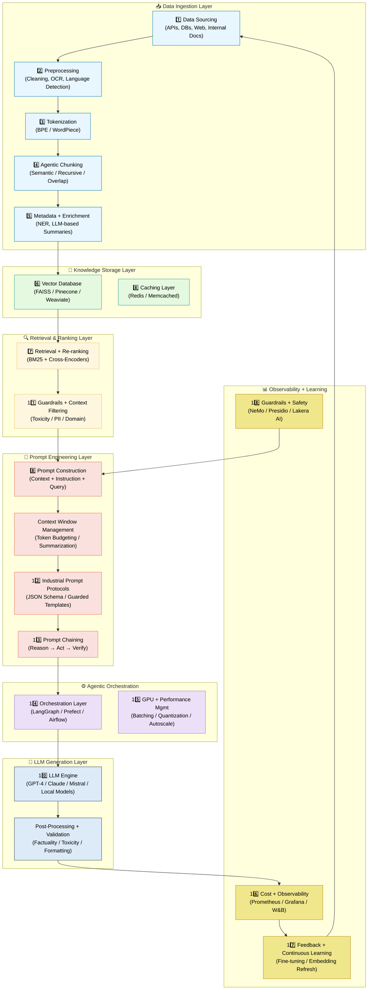

# 🧠 Industrial-Grade RAG + Agentic AI Pipeline (2025 Edition)

This document describes a **production-ready Retrieval-Augmented Generation (RAG)** and **Agentic AI system**, from data ingestion to orchestration, safety, and cost optimization — with **state-of-the-art techniques**, **free + paid tools**, and **industry patterns** used by companies like OpenAI, Anthropic, and Databricks.

---

## 🧭 Overview Flow

## 🧩 Industrial RAG + Agentic AI Pipeline – ASCII Architecture Diagram
```

┌─────────────────────────────────────────────────────────────────────┐
│                         1. DATA SOURCING                            │
│ (Web, APIs, DBs, Docs, PDFs, Internal Systems)                      │
└───────────────┬─────────────────────────────────────────────────────┘
                │
                ▼
┌─────────────────────────────────────────────────────────────────────┐
│                       2. PREPROCESSING                              │
│  • Clean, deduplicate, normalize text                               │
│  • OCR + Language detection                                         │
└───────────────┬─────────────────────────────────────────────────────┘
                │
                ▼
┌─────────────────────────────────────────────────────────────────────┐
│                       3. TOKENIZATION                               │
│  • Split text into tokens (BPE, WordPiece)                          │
└───────────────┬─────────────────────────────────────────────────────┘
                │
                ▼
┌─────────────────────────────────────────────────────────────────────┐
│                      4. AGENTIC CHUNKING                            │
│  • Semantic / recursive splitting                                   │
│  • Overlapping chunks for context                                   │
└───────────────┬─────────────────────────────────────────────────────┘
                │
                ▼
┌─────────────────────────────────────────────────────────────────────┐
│                   5. METADATA + ENRICHMENT                          │
│  • Extract entities, tags, timestamps                               │
│  • LLM agents add summaries / keywords                              │
└───────────────┬─────────────────────────────────────────────────────┘
                │
                ▼
┌─────────────────────────────────────────────────────────────────────┐
│                     6. VECTOR DATABASE STORAGE                      │
│  • Store (embedding + metadata) in Vector DB (FAISS, Pinecone, etc.)│
│  • Sharding + indexing for scale                                    │
└───────────────┬─────────────────────────────────────────────────────┘
                │
                ▼
┌─────────────────────────────────────────────────────────────────────┐
│                 7. RETRIEVAL + RE-RANKING                           │
│  • Hybrid search (BM25 + embedding)                                 │
│  • Cross-encoder / LLM re-ranking                                   │
│  • Apply guardrails to context (filter unsafe data)                 │
└───────────────┬─────────────────────────────────────────────────────┘
                │
                ▼
┌─────────────────────────────────────────────────────────────────────┐
│             8. PROMPT ENGINEERING + CONTEXT MGMT                    │
│  • Build prompt = Instruction + Retrieved Context + Query           │
│  • Manage token limits (context window)                             │
│  • Few-shot / CoT examples                                          │
│  • Schema & guardrail validation                                    │
└───────────────┬─────────────────────────────────────────────────────┘
                │
                ▼
┌─────────────────────────────────────────────────────────────────────┐
│                   9. ORCHESTRATION LAYER                            │
│  • Coordinates entire pipeline (LangGraph, Prefect)                 │
│  • Parallel / sequential agent tasks                                │
│  • Retries, logging, caching integration                            │
└───────────────┬─────────────────────────────────────────────────────┘
                │
                ▼
┌─────────────────────────────────────────────────────────────────────┐
│                   10. LLM GENERATION ENGINE                         │
│  • Query LLM (GPT-4, Claude, Mistral, etc.)                         │
│  • Apply decoding limits, JSON schema                               │
│  • Stream response                                                  │
└───────────────┬─────────────────────────────────────────────────────┘
                │
                ▼
┌─────────────────────────────────────────────────────────────────────┐
│                 11. POST-PROCESSING + VALIDATION                    │
│  • Factual verification via RAG cross-check                         │
│  • Toxicity / bias / PII filtering                                  │
│  • Structured output formatting                                     │
└───────────────┬─────────────────────────────────────────────────────┘
                │
                ▼
┌─────────────────────────────────────────────────────────────────────┐
│                12. CACHING + GPU OPTIMIZATION                       │
│  • Redis / Memcached caching                                        │
│  • Batching, quantization, mixed precision (FP16)                   │
│  • Autoscaling on Kubernetes                                        │
└───────────────┬─────────────────────────────────────────────────────┘
                │
                ▼
┌─────────────────────────────────────────────────────────────────────┐
│              13. COST + OBSERVABILITY LAYER                         │
│  • Token usage, latency, and cost monitoring                        │
│  • Dynamic model routing (small vs large LLMs)                      │
│  • Dashboards (Grafana, W&B, Datadog)                               │
└───────────────┬─────────────────────────────────────────────────────┘
                │
                ▼
┌─────────────────────────────────────────────────────────────────────┐
│          14. FEEDBACK + CONTINUOUS LEARNING LOOP                    │
│  • Log queries and user feedback                                    │
│  • Update embeddings / fine-tune models                             │
│  • Retrain periodically                                             │
└─────────────────────────────────────────────────────────────────────┘


```
## 🪄 Visual Flowchart (Mermaid Diagram)


---

## 1️⃣ Data Sourcing – Collect Knowledge Base

**Goal:** Gather raw data from diverse internal and external sources.

**SOTA Practices:**
- Multi-source ingestion (web, APIs, databases)
- Incremental syncing (detect new or updated files)
- Deduplication and checksum versioning

**Tools:**
| Free | Paid |
|------|------|
| `BeautifulSoup`, `Scrapy`, `requests`, `newspaper3k` | **Diffbot**, **Common Crawl**, **AWS Textract**, **Glean.io**, **Dataiku** |

---

## 2️⃣ Preprocessing – Clean & Normalize

**Goal:** Make text uniform, clean, and language-consistent.

**SOTA Practices:**
- Text normalization & punctuation cleaning  
- Language detection (`fastText`, `langdetect`)  
- OCR for scanned documents  

**Tools:**
| Free | Paid |
|------|------|
| `pandas`, `re`, `tika`, `ftfy`, `PyMuPDF`, `pytesseract` | **AWS Comprehend**, **Azure Cognitive Services**, **Google Cloud Document AI** |

---

## 3️⃣ Tokenization – Prepare for Embeddings

**Goal:** Split text into machine-readable tokens.

**SOTA Practices:**
- BPE / WordPiece / SentencePiece tokenization  
- Manage token budgets to fit model context windows  

**Tools:**
| Free | Paid |
|------|------|
| `tiktoken`, `sentencepiece`, `transformers` | **OpenAI Tokenizer API**, **Cohere Tokenizer** |

---

## 4️⃣ Agentic Chunking – Contextual Segmentation

**Goal:** Split long docs into meaningful, model-friendly chunks.

**SOTA Techniques:**
- Semantic Chunking (embedding breakpoints)
- Recursive and proportion-based chunking
- Agentic chunking (LLM decides split points)
- Overlap chunks for context continuity

**Tools:**
| Free | Paid |
|------|------|
| `langchain.text_splitter`, `semantic-text-splitter`, `nltk` | **Cohere Embed API**, **OpenAI Text Processing API** |

---

## 5️⃣ Metadata Extraction – Add Structure

**Goal:** Enrich chunks with metadata (timestamp, author, entity).

**SOTA Techniques:**
- Named Entity Recognition (NER)
- Tagging + domain classification
- Source path + doc type tagging

**Tools:**
| Free | Paid |
|------|------|
| `spaCy`, `stanza`, `transformers`, `presidio` | **AWS Comprehend Entities**, **Azure Language AI**, **Google Vertex AI** |

---

## 6️⃣ Agent-Based Enrichment – Add Intelligence

**Goal:** Use LLM agents to generate summaries, tags, keywords, and QA pairs.

**SOTA Techniques:**
- LLM summarization & keyword extraction
- Graph enrichment (entity linking)
- Domain adaptation (finance, legal, healthcare)

**Tools:**
| Free | Paid |
|------|------|
| `LangChain agents`, `LlamaIndex transformers` | **OpenAI Assistants API**, **Cohere Command R+**, **Anthropic Claude 3 API** |

---

## 7️⃣ Storage – Vector DB & Indexing

**Goal:** Store embeddings & metadata for fast semantic search.

**SOTA Techniques:**
- Vector indexing (HNSW, IVF, PQ)
- Hybrid (keyword + vector) retrieval
- Scalable sharding & replication

**Tools:**
| Open Source | Paid / Managed |
|--------------|----------------|
| **FAISS**, **Chroma**, **Milvus**, **Qdrant** | **Pinecone**, **Weaviate Cloud**, **AWS Kendra**, **Azure Cognitive Search** |

---

## 8️⃣ Vector Database Mechanics

**Goal:** Perform efficient nearest-neighbor retrieval.

**SOTA Techniques:**
- HNSW, IVF for high recall & speed
- Product Quantization for compression
- GPU-accelerated vector search

**Tools:**
| Free | Paid |
|------|------|
| `FAISS-GPU`, `Qdrant`, `Chroma` | **Pinecone Enterprise**, **Redis Vector Search**, **Weaviate Pro** |

---

## 9️⃣ Caching Layer – Speed & Cost Efficiency

**Goal:** Reuse previous results to minimize latency and cost.

**SOTA Practices:**
- Query caching for repeated user questions
- Response caching for repeated LLM outputs
- Hybrid caching (vector + text)

**Tools:**
| Free | Paid |
|------|------|
| **Redis**, **Memcached**, **SQLite** | **Upstash Redis Cloud**, **AWS ElastiCache**, **Pinecone Edge Cache** |

---

## 🔟 Retrieval & Re-ranking

**Goal:** Select the most relevant context for the query.

**SOTA Techniques:**
- Hybrid retrieval (BM25 + embeddings)
- Cross-encoder re-ranking (`ms-marco-MiniLM`)
- LLM-based semantic scoring

**Tools:**
| Free | Paid |
|------|------|
| `sentence-transformers`, `pyserini` | **Cohere Rerank API**, **AWS Kendra Ranking**, **Azure Search Reranker** |

---

## 11️⃣ Prompt Engineering & Context Window Management

**Goal:** Build optimal, cost-efficient prompts for the LLM.

**SOTA Practices:**
- Dynamic templates (context + query + instruction)
- Chain-of-thought / few-shot prompting
- Context window budgeting (fit within model’s token limit)
- Automatic summarization of long context

**Tools:**
| Free | Paid |
|------|------|
| **LangChain PromptTemplate**, `LlamaIndex QueryEngine` | **PromptLayer**, **Humanloop**, **OpenAI Functions**, **Anthropic Templates** |

---

## 12️⃣ Industrial Prompt Protocols

**Goal:** Maintain consistent prompts across environments.

**SOTA Techniques:**
- JSON schema enforcement
- Guarded templates
- Version-controlled prompts

**Tools:**
| Free | Paid |
|------|------|
| `pydantic`, `guardrails-ai`, `jsonschema` | **Vellum AI**, **LangSmith**, **PromptLayer** |

---

## 13️⃣ Prompt Chaining – Multi-Step Reasoning

**Goal:** Execute reasoning tasks step-by-step.

**SOTA Techniques:**
- Reason → Act → Verify loops
- Reflection chains
- Multi-agent conversation flows

**Tools:**
| Free | Paid |
|------|------|
| **LangGraph**, **CrewAI**, **Autogen** | **Fixie AI**, **Semantic Kernel**, **Dust AI Flow** |

---

## 14️⃣ Orchestration Layer – Process Control

**Goal:** Coordinate data flow, agents, and task execution.

**SOTA Practices:**
- DAG-based pipelines (Prefect, Airflow)
- State management between steps
- Parallel & sequential execution
- Auto retries, fallbacks, logging

**Tools:**
| Free | Paid |
|------|------|
| **Prefect**, **LangGraph**, **Celery**, **Ray Serve** | **Databricks Workflows**, **Airflow Cloud**, **AWS Step Functions** |

---

## 15️⃣ GPU & Performance Management

**Goal:** Optimize compute resources for scalability.

**SOTA Techniques:**
- Batching & mixed precision (FP16)
- Quantization (INT8, 4-bit)
- Autoscaling (Kubernetes)
- Streaming responses

**Tools:**
| Free | Paid |
|------|------|
| `torch.cuda`, `bitsandbytes`, `vLLM`, `TGI` | **RunPod**, **Modal**, **NVIDIA Triton**, **AWS Inferentia**, **Azure ML Compute** |

---

## 16️⃣ Post-Processing & Feedback Loop

**Goal:** Validate outputs and continuously improve.

**SOTA Techniques:**
- LLM-as-judge evaluation
- User feedback integration
- Retrieval fidelity scoring (Precision, Recall)

**Tools:**
| Free | Paid |
|------|------|
| **LangSmith**, **W&B**, `mlflow` | **Humanloop**, **Traceloop**, **Databricks Monitoring** |

---

## 17️⃣ Guardrails & Safety

**Goal:** Ensure system is safe, compliant, and factual.

**SOTA Techniques:**
- Input sanitization / prompt-injection detection
- PII & toxicity filtering
- JSON schema validation
- Factual verification via secondary retrieval

**Tools:**
| Free | Paid |
|------|------|
| `Guardrails-AI`, `Rebuff`, `Presidio`, `OpenAI moderation API` | **NVIDIA NeMo Guardrails**, **Azure AI Content Safety**, **ProtectAI**, **Lakera AI**, **AWS Comprehend** |

---

## 18️⃣ Cost Optimization & Observability

**Goal:** Minimize operational cost & monitor system health.

**SOTA Practices:**
- Dynamic model routing (small vs large models)
- Context compression / summarization
- Caching (aim for >50% hit rate)
- GPU scheduling + autoscaling
- Token budget tracking

**Tools:**
| Free | Paid |
|------|------|
| **Prometheus + Grafana**, `LangSmith token logger` | **Weights & Biases**, **Datadog**, **OpenAI Usage API**, **AWS CloudWatch**, **Humanloop** |

---

## 19️⃣ Continuous Learning & Fine-Tuning (Optional)

**Goal:** Make the system self-improving.

**SOTA Techniques:**
- Active learning from user feedback
- Fine-tuning LLMs using LoRA / QLoRA
- Updating embedding models periodically

**Tools:**
| Free | Paid |
|------|------|
| **PEFT**, **LoRA**, `transformers`, `datasets` | **W&B Train**, **Azure ML**, **AWS SageMaker**, **Cohere Finetune API** |

---

---

---

## 🧮 21️⃣ Evaluation & Benchmarking Metrics

**Goal:**  
Measure and monitor how accurate, relevant, and trustworthy your RAG + Agentic AI pipeline is — across retrieval, generation, and overall system quality.

---

### 🧠 State-of-the-Art Practices (2025)

| Evaluation Level | Core Metrics | What It Measures |
|------------------|--------------|------------------|
| **Retrieval Quality** | Context Precision · Context Recall · nDCG | Whether the system retrieves the right evidence chunks. |
| **Generation Quality** | Faithfulness · Factual Consistency · Answer Relevance | Whether answers are grounded and address the user query. |
| **End-to-End RAG Score** | Weighted average of all sub-scores | Combined indicator of retrieval + generation quality. |
| **Human / LLM-as-Judge Evaluation** | Scaled rating or pairwise ranking | Qualitative validation by human or LLM. |
| **Latency & Cost** | Response time · Token usage | Operational performance. |

---

### ⚖️ RAGAS vs DeepEval — Metric Comparison

| **Metric** | **RAGAS Support** | **DeepEval Support** | **Purpose** |
|-------------|------------------|----------------------|--------------|
| Context Precision | ✅ | ✅ (as Context Relevance) | How relevant retrieved docs are. |
| Context Recall | ✅ | ⚙️ Partial | Whether necessary evidence was retrieved. |
| Context Relevance | ✅ | ✅ | Semantic match between query ↔ context. |
| Faithfulness (Groundedness) | ✅ | ✅ | Factual alignment of answer ↔ context. |
| Answer Relevance | ✅ | ✅ | Does the answer actually address the question? |
| Factual Consistency | ⚙️ Partial | ✅ | Checks factual correctness of generated statements. |
| Answer Correctness / Similarity | ✅ | ✅ | Match against gold/reference answers. |
| Context Utilization | ⚙️ Experimental | ✅ | How effectively retrieved text was used. |
| Coherence / Readability | ❌ | ✅ | Structural and grammatical quality. |
| Toxicity / Bias | ❌ | ✅ | Detects unsafe or biased outputs. |
| Latency / Cost | ❌ | ✅ | Measures performance and token efficiency. |

---

### 🧩 Frameworks & Libraries

| Category | Free / Open Source | Enterprise / Managed |
|-----------|------------------|----------------------|
| **Retrieval Eval** | `RAGAS`, `LangChain Evaluation`, `TruLens`, `DeepEval` | **Weights & Biases Eval Suite**, **PromptLayer Studio** |
| **Generation Eval** | `DeepEval`, `HuggingFace Evaluate`, `G-Eval` | **Humanloop**, **Anthropic Evaluator API** |
| **End-to-End RAG Testing** | `ragas.evaluate()`, `deepeval.Evaluator` | **OpenAI Evals**, **Databricks LLMOps Monitor** |
| **Latency / Cost Tracking** | `Prometheus + Grafana`, `LangSmith Metrics` | **W&B Telemetry**, **Datadog Monitor** |

---

### 🧪 Example Code Snippets

**RAGAS Example**
```python
from ragas import evaluate
from datasets import load_dataset

dataset = load_dataset("ragas/benchmark", "fiqa")
scores = evaluate(dataset, metrics=["faithfulness", "answer_relevance", "context_precision"])
print(scores)
```
**DeepEval Example**
```python
from deepeval import evaluate

evaluate(
    model="gpt-4-turbo",
    dataset="qa_eval.json",
    metrics=[
        "faithfulness",
        "factual_consistency",
        "context_relevance",
        "answer_relevance"
    ]
)
```

### 📈 Integration in Pipeline

```text
... → 16️⃣ Post-Processing
      ↓
 21️⃣ Evaluation & Benchmarking Metrics
      ↓
 19️⃣ Continuous Learning / Fine-Tuning
The evaluation stage runs automatically after post-processing and before fine-tuning to provide real-time quality feedback.
```

### 🧩 Placement Summary

| Step | Stage | Primary Tools | Key Metrics |
|------|--------|----------------|--------------|
| 21️⃣ | Evaluation & Benchmarking Metrics | RAGAS, DeepEval, TruLens, LangSmith | Faithfulness, Relevance, Recall@k, Factual Consistency, Latency |

**✅ Best Practice**

Combine RAGAS (for retrieval-level diagnostics) with DeepEval (for holistic LLM evaluation).
This gives both quantitative and qualitative insight into RAG performance.

---

## ✅ Final Summary

> **Industrial-Grade RAG = Clean Data + Intelligent Retrieval + Safe Prompting + Cost-Efficient Inference + Scalable Orchestration + Continuous Feedback.**

---

## 📚 Recommended References

- [LangChain Docs](https://python.langchain.com/)
- [LlamaIndex Docs](https://docs.llamaindex.ai/)
- [NVIDIA NeMo Guardrails](https://developer.nvidia.com/nemo-guardrails)
- [Pinecone Vector DB](https://www.pinecone.io/)
- [LangGraph (Stateful Agent Framework)](https://docs.langchain.com/langgraph/)
- [Cohere Rerank API](https://docs.cohere.com/)
- [Weights & Biases LLMOps](https://wandb.ai/site)
- [Prefect Workflow Orchestrator](https://www.prefect.io/)

---
